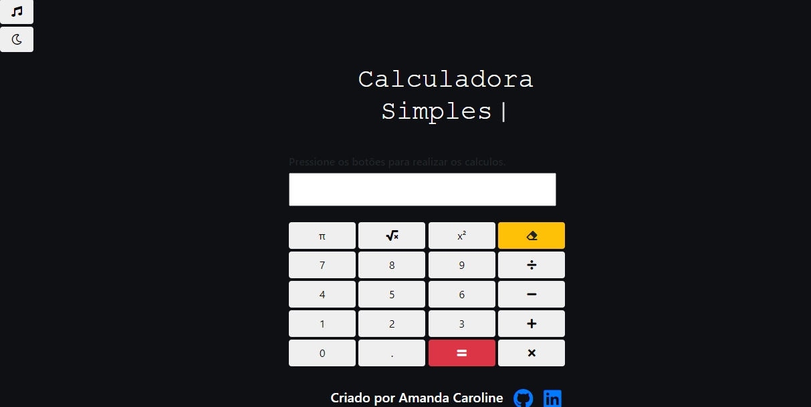
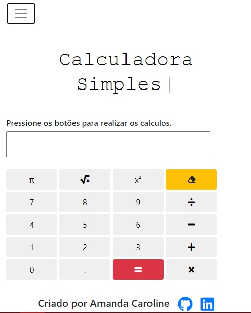

<h1 align="center">
  
</h1>

<h2>:computer: Sobre o Projeto:</h2>

Projeto criado para fins de treinamento em Javascript, onde o usuário usa os números de 0-9 através de botões.

<h2>:wrench: Funcionalidades</h2>

4 operações principais: 
<ul>
<li>Adição</li>
<li>Subtração</li>
<li>Divisão</li>
<li>Multiplicação</li>
</ul>

E outras outras funcionalidades como:

<ul>
<li>Potência</li>
<li>Raiz Quadrada</li>
<li>Valor de Pi</li>
<li>Botão de Limpar</li>
<li>Modo Escuro</li>
<li>Efeito Sonoro ao clicar nos botões</li>
</ul>
<h2>:calendar: Status do Projeto</h2>

Completo

<h2>:art: Layout</h2>
<h5>Desktop - Dark Mode
</h5>

<h5>Mobile  - Bright Mode
</h5>

<h4>Se você gostou e gostaria de experimentar <a href="https://simple-calculator-mands.netlify.app/" alt="link do projeto">clique aqui</a></h4>
<h2>:ballot_box_with_check: Tecnologias</h2>

A ferramenta a seguir foi utilizada na construção do layout do projeto

<a href="https://getbootstrap.com/">Bootstrap 4</a>
<h2>:white_check_mark: Licença</h2>

<h2>:raising_hand: Autor</h2>

Amanda Caroline

<a href="https://www.linkedin.com/in/amandaalmeidaacsa/" alt="Linkedin">Entre em Contato!</a>

Feito com muito :purple_heart: 

